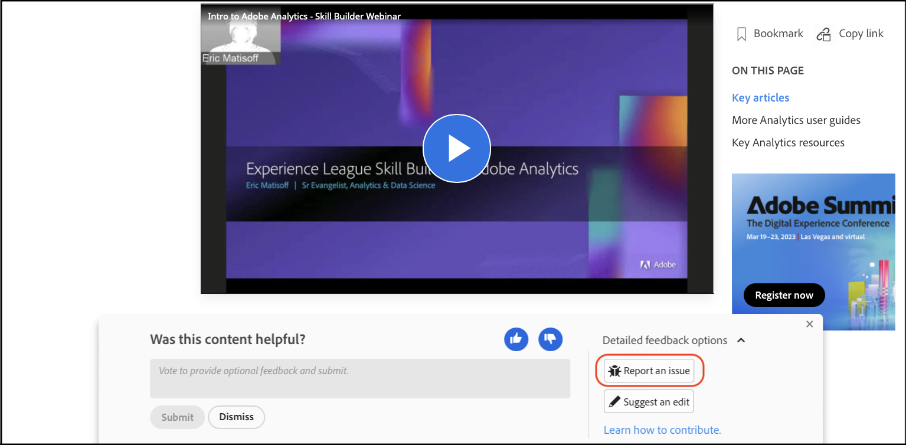

# Medewerkershandleiding voor documentatie bij Adobe

In deze handleiding wordt beschreven hoe u een bijdrage kunt leveren aan de Adobe Enterprise Help op het Experience League.

## Wat is documentatie voor samenwerking?

De technische documentatie en enablement inhoud voor Adobe Experience Cloud en andere producten van de Onderneming van de Adobe zijn gebaseerd op open bronprincipes die de oplossingen GitHub, Markdown, en van Adobe Experience Cloud gebruiken.

Dit open-sourcemodel verbetert de kwaliteit van de inhoud en de communicatie tussen klanten, documentatieteams en productteams. Op elke pagina kunt u nu het nut van inhoud beoordelen, problemen met het logbestand bekijken en zelfs inhoudssuggesties leveren als Git pull-aanvragen (PR&#39;s). De documentatieteams van de Adobe houden dagelijks toezicht op de bijdragen en problemen en voeren zo nodig updates, bijstellingen en aanpassingen uit.

## Werken met documentatie voor samenwerken

Als gebruiker van dit materiaal - ongeacht als u een werknemer, een partner, een klant of zelfs potentiële klanten bent - hebt u de keus om aan deze documentatie op verscheidene eenvoudige manieren bij te dragen.

* De vraag of de pagina nuttig ❶ en een optionele opmerking ❷
* Een probleem rapporteren op een specifieke pagina (vereist aanmelding bij it) ❸
* Plaats een snelle bewerking voor het ontwerpen van gehele artikelen, compleet met elementen en codevoorbeelden (hiervoor is Git-aanmelding vereist) ❹

Deze opties worden een paar seconden na het openen onder aan de pagina weergegeven. Als u het feedbackgebied sluit, kunt u de pagina opnieuw laden om deze terug te halen.

In deze handleiding wordt alles beschreven wat u moet weten om te communiceren met en bij te dragen aan deze materiaalset.

<!--
>[!IMPORTANT]
>All repositories that publish to docs.adobe.com have adopted the [Adobe Open Source Code of Conduct](../code-of-conduct.md) or the [.NET Foundation Code of Conduct](https://dotnetfoundation.org/code-of-conduct). For more information, see the [Contributing](../contributing.md) article.
>
> Minor corrections or clarifications to documentation and code examples in public repositories are covered by the [Adobe Documentation Terms of Use](https://www.adobe.com/legal/terms.html). New or significant changes generate a comment in the pull request, asking you to submit an online Contribution License Agreement (CLA) if you are not an employee of Adobe. We need you to complete the online form before we can review or accept your pull request.
-->

## De bruikbaarheid van de pagina beoordelen en een opmerking schrijven

Een paar seconden nadat u een pagina hebt geopend, wordt onder aan de pagina een feedbackgebied weergegeven. Klik omhoog of omlaag om aan te geven of de pagina nuttig was.

Voel u vrij om een opmerking te geven voor extra feedback.

## Snelle bewerkingen uitvoeren op bestaande documenten

Als u gedetailleerdere feedback wilt geven, kunt u met behulp van snelle bewerkingen kleine fouten en weglatingen in documenten corrigeren. Wanneer u een bewerking voorstelt, verzendt u een pull-verzoek (PR) om de correctie/suggestie naar ons te verzenden en kunnen we de suggestie doorlichten, goedkeuren en publiceren.

1. Onderteken de [ Overeenkomst van de Vergunning van de Medewerker (CLA) ](http://opensource.adobe.com/cla.html) als aanvaardbaar.

   U hoeft slechts één keer een Adobe CLA in te dienen.

1. In terugkoppelt gebied dat bij de bodem van het artikel verschijnt, klik **[!UICONTROL Detailed feedback options]**, en klik dan **[!UICONTROL Suggest an edit]** om naar het prijsbenedenbrondossier op GitHub te gaan.

    uit

1. Klik op het potloodpictogram om het artikel te bewerken.

   >[!NOTE]
   >
   >Als het potloodpictogram grijs uit is, moet u login aan uw rekening GitHub, of een nieuwe rekening tot stand brengen.

   

1. Breng de gewenste wijzigingen aan in de webeditor.

   U kunt op de tab **[!UICONTROL Preview changes]** klikken om de opmaak van de wijziging te controleren.

1. Blader naar de onderkant van de pagina nadat u de wijzigingen hebt aangebracht.

   Voer een titel en beschrijving voor de PR in en klik op **[!UICONTROL Propose file change]** zoals in de volgende afbeelding wordt getoond:

   

   >[!NOTE]
   >
   >Als er een foutbericht verschijnt over het ondertekenen van een Contribute-licentieovereenkomst (CLA), klikt u op **[!UICONTROL Details]** om de licentieovereenkomst te openen. Onderteken de overeenkomst, indien acceptabel. Vervolgens sluit u het verzoek en opent u het verzoek en gaat u verder.

Dat is alles wat er aan te pas komt. De leden van het documentatieteam zullen uw trekkrachtverzoek herzien en samenvoegen. Bedankt!

## Een probleem melden

Een andere gemakkelijke manier om ons op de hoogte te brengen van een probleem met een stuk inhoud is om **[!UICONTROL Report an issue]** te gebruiken.

1. In terugkoppelt gebied dat bij de bodem van het artikel verschijnt, klik **[!UICONTROL Detailed feedback options]**, en klik dan **[!UICONTROL Report an issue]** om naar het prijsbenedenbrondossier op GitHub te gaan.

   

   >[!NOTE]
   >
   >Om een kwestie te melden, moet u login aan uw rekening GitHub, of een rekening tot stand brengen.

   Als u op deze koppeling klikt, kunt u een snel ticket aanmelden bij het Experience League via de interface voor Github Issue.

   De URL van de pagina met de uitgave wordt automatisch ingevuld in het beschrijvingsveld.

1. Vul de titel in, schrijf een korte beschrijving van de kwestie, en klik dan *voorleggen nieuwe kwestie*.

   

Als u een uitgave verzendt, wordt het inhoudsteam op de hoogte gebracht van deze pagina, die uw probleem kan verhelpen. Als we de inhoud hebben bijgewerkt, geven we dit via de interface Github Issues door en sturen we u een e-mail wanneer deze wordt bijgewerkt of gesloten.

## GitHub-machtigingen begrijpen

De GitHub die UI uitgeeft past aan uw bewaarplaatstoestemmingen aan. De voorgaande afbeeldingen zijn accuraat voor contribuanten die geen schrijfmachtigingen hebben voor de doelopslagplaats. GitHub leidt automatisch tot een vork van de doelbewaarplaats in uw rekening. Als u toegang tot de doelbewaarplaats hebt schrijven, leidt GitHub tot een nieuwe tak in de doelrepo.

Adobe gebruikt trekkingsverzoeken voor alle wijzigingen, zelfs voor contribuanten die schrijftoegang hebben. De meeste repositories hebben de `main` -vertakking beveiligd, zodat updates moeten worden verzonden als pull-aanvragen.

De bewerkervaring in de browser is het meest geschikt voor kleine of niet-frequente wijzigingen. Als u grote bijdragen maakt, of de geavanceerde eigenschappen van het Git gebruikt, adviseren wij dat u [ de repo en het werk plaatselijk ](setup/full-workflow.md) fork.

## Feedback geven

Als de oplossing zo groot is als de Adobe, is de documentatie altijd een werk in uitvoering. Als u fouten ontdekt, registreer een kwestie, als u suggesties op materiaal hebt te vertellen gelieve ons. Vertel ons welke informatie u zocht. Laat ons weten of u niet kon vinden wat u nodig had, of als u moeite had om uw taak te voltooien, gelieve ons te vertellen hoe wij u kunnen helpen onze oplossingen leren.

Dank van het Collaborative Documentation team en alle schrijvers en inhoudsproducenten in Experience League.
