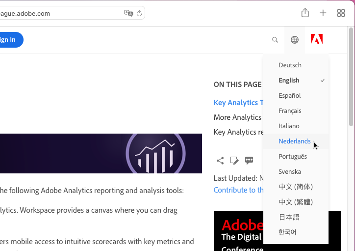
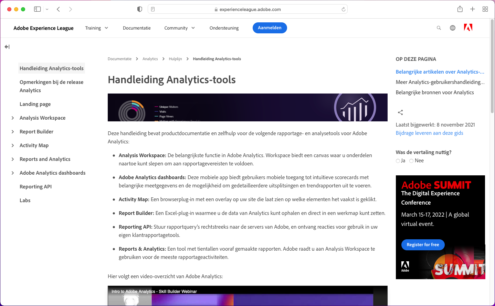
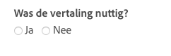

# Taalondersteuning voor Adobe Experience Cloud - Productdocumentatie

Adobe herkent dat u afhankelijk bent van productdocumentatie, Help en ondersteuning, zodat deze direct beschikbaar zijn in talen die worden ondersteund door Adobe-producten. Om dit doel te bereiken, biedt Adobe een unieke vertaalervaring waarmee u de taal van uw keuze kunt selecteren en feedback over de kwaliteit van vertaalde inhoud kunt geven.

## Taal selecteren

U kunt de Adobe Experience Cloud-productdocumentatie in de meeste talen weergeven.

1. Ga naar de [productdocumentatie](https://helpx.adobe.com/support/experience-cloud.html)van Experience Cloud.

1. Blader naar een Help-pagina (bijvoorbeeld [Analytics](https://docs.adobe.com/content/help/en/analytics/landing/home.html)).

1. Klik op het pictogram Taalkiezer (wereldpictogram) en kies een taal.

   

   De pagina wordt weergegeven in de taal die u hebt geselecteerd.

   

   Als uw taalversie nog niet beschikbaar is, kan Adobe uw inhoud automatisch vertalen. De automatische vertaalservice van Adobe geeft boven aan de pagina een bericht weer in een blauw veld:

   

   De inhoud wordt mogelijk automatisch in uw taal weergegeven of u kunt op een koppeling klikken om de vertaling te activeren. (Dit scenario kan voorkomen wanneer u op hyperlink hebt geklikt om aan de Engelse bron van de vertaalde pagina terug te keren. Hiermee kunt u de vertaalde pagina op aanvraag bekijken.) U kunt op elk ogenblik aan de Engelse bron terugkeren.

   Soms is de Engelse broninhoud onlangs bijgewerkt en gepubliceerd voordat de vertalingen zijn voltooid. Nadat u in het vervolgkeuzemenu op uw taal hebt geklikt, verschijnt er een melding — in de lichtblauwe horizontale balk boven aan de pagina — dat de pagina automatisch is vertaald vanuit de vorige versie, met bijgewerkte inhoud die binnenkort beschikbaar is. U kunt desgewenst de meest recente Engelse broninhoud in een nieuw browservenster weergeven.

## Waarom automatische vertaling gebruiken

Adobe benut de automatische vertaalmogelijkheden om inhoud voor productondersteuning in verschillende talen te publiceren, zo dicht mogelijk bij de tijd die nodig is om inhoud te maken. Omdat supportinhoud van essentieel belang is voor het productgebruik, geven we prioriteit aan het vertalen van inhoud door gekwalificeerde professionals, maar we kunnen ook kiezen voor automatische vertaling waar snelheid en urgentie het belangrijkst zijn.

Automatische vertaling is alomtegenwoordig op het internet en het gebruik ervan wordt algemeen aanvaard als een krachtig instrument voor het verzamelen van informatie. Het is algemeen aanvaard voor de inhoud van de kennisbasis, waar weinig tot geen menselijke tussenkomst mogelijk is. Hoewel er de afgelopen jaren grote technologische doorbraken hebben plaatsgevonden, kunnen automatisch gegenereerde vertalingen incidentele onnauwkeurigheden en taalfouten bevatten.

### Automatische vertaling via de browser

Als u uw browservoorkeuren zo hebt ingesteld dat pagina&#39;s automatisch in uw taal worden vertaald, moet u er rekening mee houden dat de resulterende vertalingen afwijken van de vertalingen die via de Adobe-pagina worden verkregen. De reden hiervoor is dat de service die door de browser wordt aangeboden, bestaat uit vertalingen van het type stock, terwijl de Adobe-vertalingen zijn aangepast aan de richtlijnen en terminologie voor Adobe-stijlen. Voor optimale automatische vertaalresultaten raden we u aan de browseroptie voor deze specifieke site uit te schakelen in uw browservoorkeuren of op **Nooit vertalen** te klikken wanneer deze wordt weergegeven.

### Bekende problemen

Soms kunt u problemen ondervinden met de automatische uitvoer van vertalingen, zoals onvolledige vertalingen, beschadigde tekens of problemen met de pagina-indeling. Deze worden veroorzaakt door de verschillende programma&#39;s voor ontwerp-, publicatie- of vertaaltechnologie die Adobe gebruikt. We zullen alles in het werk stellen om de onderstaande bekende problemen op te sommen.

| **UITGAVE-ID** | **BESCHRIJVING** | **STATUS** |
|--------------|-------------------------------------------------------------------------------------|------------|
| G11N3558 | Sommige pagina&#39;s van Audience Manager zijn half Engels en half vertaald (Frans, Spaans). | OPENEN |

### Feedback

Wanneer inhoud automatisch wordt vertaald, standaard of door actie van de gebruiker, is er een optie om Adobe feedback over de vertalingen te geven. In de lichtblauwe horizontale balk boven aan de pagina kunt u &quot;Ja&quot; of &quot;Nee&quot; antwoorden op de vraag &quot;Was deze vertaling nuttig?&quot;. Adobe verzamelt deze waardevolle gegevens en analyseert deze gecompileerde gegevens om beslissingen te nemen over het vertalen van inhoud. We waarderen je feedback en moedigen je aan te reageren.

In de toekomst zullen we u in staat stellen uitgebreidere feedback te geven, in de vorm van het registreren van een probleem, het aanbrengen van voorgestelde verbeteringen en zelfs het vragen van extra talen. Sommige van deze functies zijn al beschikbaar op de Engelse pagina&#39;s. Op de lange termijn geloven we dat dit Adobe zal helpen de gebruikerservaring op deze pagina&#39;s te verbeteren.

### Disclaimer vertaling

Adobe gebruikt een programma voor automatische vertaling om tekst in een aantal verschillende talen te vertalen. Vergeet niet dat geautomatiseerde vertalingen letterlijke vertalingen zijn en fouten kunnen bevatten. Adobe garandeert niet de nauwkeurigheid, betrouwbaarheid of tijdigheid van de geleverde vertalingen. Adobe is niet verantwoordelijk voor eventuele verliezen of schade als gevolg van de nauwkeurigheid of betrouwbaarheid van vertaalde gegevens. Als er verschillen zijn tussen Engels en een andere taal, controleert de Engelse versie.

Als u een vertaalfout of onjuistheid wilt melden, raden we u aan contact met ons op te nemen.
