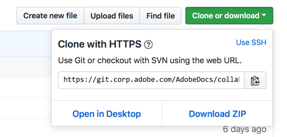

# Git-opslagplaats lokaal instellen voor documentatie

In dit artikel worden de stappen beschreven voor het instellen van een git-opslagplaats op uw lokale computer, met de bedoeling om bij te dragen aan de documentatie van de Adobe. Medewerkers kunnen een lokaal gekloonde opslagplaats gebruiken om nieuwe artikelen toe te voegen, bestaande artikelen ingrijpend te bewerken of illustraties te wijzigen.

>[!IMPORTANT]
>Als u slechts minder belangrijke veranderingen in een artikel aanbrengt, te hoeven u *niet* niet om de stappen in dit artikel te voltooien. U kunt eenvoudig op het pictogram Bewerken klikken en tekst bewerken in uw browser.

## Overzicht

Om aan de documentatie van de Adobe bij te dragen, kunt u de aangewezen bewaarplaats in uw eigen rekening forkGitHub zodat u lees-schrijf toestemmingen hebt. Vervolgens kunt u Markdown-bestanden lokaal maken en bewerken door de corresponderende documentatieopslagplaats te klonen. Vervolgens gebruikt u pull-aanvragen om wijzigingen samen te voegen (te verzenden) in de alleen-lezen centrale gedeelde opslagplaats.

* Bepaal de juiste opslagplaats
* Maak de gegevensopslagplaats aan uw rekening van GitHub
* Een lokale map voor de gekloonde bestanden kiezen
* De opslagplaats klonen naar uw lokale computer
* De externe upstream-waarde configureren

## De opslagplaats bepalen

U vork de aangewezen bewaarplaats in uw eigen rekening GitHub zodat u gelezen/schrijftoestemmingen daar hebt om uw voorgestelde veranderingen op te slaan. [!UICONTROL Adobe Experience Cloud] documentatie verblijft in verscheidene verschillende bewaarplaatsen bij [ github.com ](https://www.github.com/adobedocs).

1. Als u niet zeker weet welke repository u moet gebruiken, gaat u naar het artikel met uw webbrowser. Selecteer **uitgeven** verbinding (potloodpictogram) op het hogere recht van het artikel. (Als u geen Edit verbinding ziet, is die inhoud nog niet beschikbaar in GitHub.)

Als u een bijdrage wilt leveren aan de documentatie van de Adobe, kunt u Markeringen lokaal maken en bewerken door de corresponderende documentatieopslagplaats te klonen. Vervolgens gebruikt u trekkingsverzoeken om wijzigingen samen te voegen in de alleen-lezen centrale gedeelde opslagplaats.

<!---

If you're new to GitHub, watch the following video for a conceptual overview of the forking and cloning process:

>[!VIDEO https://channel9.msdn.com/Blogs/CoolMoose/Git-Repository-Setup/player]
-->

## Fork the repository

Gebruikend de aangewezen bewaarplaats, creeer een vork van de bewaarplaats in uw eigen rekening GitHub door de website te gebruiken GitHub.

Een persoonlijke vork is vereist omdat alle hoofddocumentatieruimten alleen-lezen toegang bieden, wat betekent dat u geen wijzigingen rechtstreeks kunt aanbrengen in de inhoud in de opslagruimten. Als u wijzigingen wilt aanbrengen, moet u een pull-aanvraag (PR) van uw vork indienen in de hoofdopslagplaats. Om dit proces te vergemakkelijken, hebt u eerst uw eigen exemplaar van de bewaarplaats nodig, waarin u schrijftoegang hebt. A GitHub *vork* dient dat doel.

1. Ga naar de pagina GitHub van de belangrijkste bewaarplaats en klik de **1} knoop van het Fork {op het hogere recht.**

   

1. Als u wordt veroorzaakt, selecteer uw GitHub rekeningstegel als bestemming waar de vork zou moeten worden gecreeerd. Deze herinnering leidt tot een exemplaar van de bewaarplaats binnen uw rekening GitHub, die als vork wordt bekend.

1. Kies een mapnaam die u gemakkelijk kunt onthouden en typen.

   Sommige opslagruimten kunnen groot zijn. Kies een locatie met beschikbare schijfruimte.

   >[!NOTE]
   >
   >Kies geen lokaal mappad dat is genest in een andere locatie in de map van de it-opslagplaats. Hoewel het acceptabel is om de gekloonde mappen aan elkaar te koppelen, leidt het nesten van git-mappen in elkaar tot fouten bij het bijhouden van het bestand.

## Een lokale kloon maken van de opslagplaats

Door een kloon van de geforceerde opslagplaats te maken, downloadt u een kopie van de bestanden naar uw computer. Als u klaar bent, kunt u bewerkingen van uw lokale station naar de geforceerde opslagplaats op de server uitvoeren. Vervolgens kunt u een pull-verzoek indienen om de bewerkingen upstream samen te voegen met de hoofdopslagplaats.

Deze stappen veronderstellen u de Desktop GitHub gebruikt. Als u een andere client gebruikt, brengt u de gewenste aanpassingen aan.

1. Klik **Kloon of download** en kies dan **Open in Desktop** om een exemplaar van de bewaarplaats (uw vork) neer aan uw computer op de huidige folder te trekken.

   

1. De Desktop van GitHub van het gebruik om de lokale dossiers in synchronisatie met de forked bewaarplaats te houden.

Voor details, zie {de Documentatie van de Desktop van 0} GitHub ](https://help.github.com/desktop/).[
