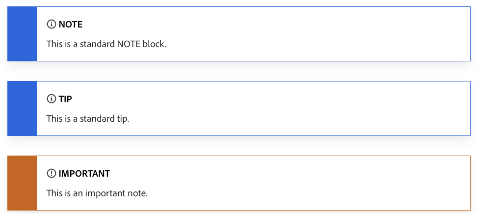
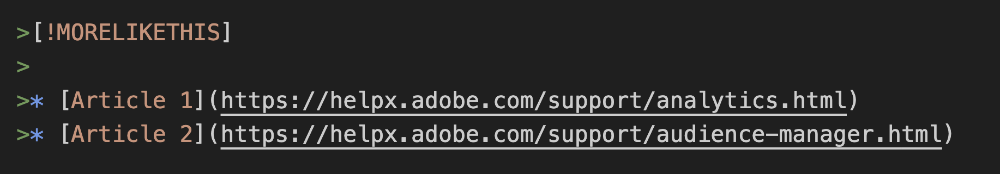

# Hoe wordt Markdown gebruikt voor het schrijven van technische documentatie

De artikelen in de technische documentatie van de Adobe worden geschreven in een lichte opmaaktaal die [Markering](https://daringfireball.net/projects/markdown/), wat zowel gemakkelijk leesbaar als gemakkelijk te leren is.

Aangezien wij de inhoud van Docs van de Adobe in GitHub opslaan, kan het een versie van Markdown gebruiken geroepen [GitHub Flavoed Markdown (GFM)](https://help.github.com/categories/writing-on-github/), die aanvullende functionaliteit biedt voor veelvoorkomende opmaakbehoeften. Bovendien heeft de Adobe Markdown op een aantal manieren uitgebreid om bepaalde aan Help gerelateerde functies zoals notities, tips en ingesloten video's te ondersteunen.

## Basisprincipes voor markdown

In de volgende secties worden de grondbeginselen van het ontwerpen in Markdown beschreven.

### Koppen

Als u een kop wilt maken, gebruikt u een hash-teken (#) aan het begin van een regel:

```
# This is level 1 (article title)
## This is level 2
### This is level 3
#### This is level 4
##### This is level 5
```

### Standaardtekst

Een alinea vereist geen speciale syntaxis in Markdown.

Tekst opmaken als **vet**, plaatst u deze in twee sterretjes. Tekst opmaken als *cursief*, plaatst u deze in één sterretje:

```markdown
   This text is **bold**.
   This text is *italic*.
   This text is both ***bold and italic***.
```

Als u opmaaktekens voor opmaak wilt negeren, gebruikt u \ vóór het teken:

```markdown
This is not \*italicized\* type.
```

### Genummerde lijsten en lijsten met opsommingstekens

Als u genummerde lijsten wilt maken, begint u met een regel met `1.` of `1)`, maar gebruik beide indelingen niet in dezelfde lijst. U hoeft de getallen niet op te geven. GitHub doet dat voor jou.

```markdown
1. This is step 1.
1. This is the next step.
1. This is yet another step, the third.
```

Weergegeven:

1. Dit is stap 1.
1. Dit is de volgende stap.
1. Dit is nog een stap, de derde.

Als u opsommingstekens wilt maken, begint u met een regel met \* of - of +, maar combineert u de indelingen niet in dezelfde lijst. (Gebruik in hetzelfde document geen opsommingstekens, zoals \* en \+.)

```markdown
* First item in an unordered list.
* Another item.
* Here we go again.
```

Weergegeven:

* Eerste item in een ongeordende lijst.
* Nog een item.
* Hier gaan we weer.

U kunt lijsten binnen lijsten ook insluiten en inhoud tussen lijstpunten toevoegen.

```markdown
1. Set up your table and code blocks.
1. Perform this step.

   

1. Make sure that your table looks like this: 

   | Hello | World |
   |---|---|
   | How | are you? |  

1. This is the fourth step.

   >[!NOTE]
   >
   >This is note text.

1. Do another step.
```

Weergegeven:

1. Stel uw tabel- en codeblokken in.
1. Voer deze stap uit.

   

1. Zorg ervoor dat uw tabel er zo uitziet:

   | Hallo | Wereld |
   |---|---|
   | Hoe | Ben je dat? |

1. Dit is de vierde stap.

   >[!NOTE]
   >
   >Dit is notitietekst.

1. Doe nog een stap.

### Tabellen

Tabellen maken geen deel uit van de kernspecificatie Markering, maar de Adobe ondersteunt ze in zekere mate. Markering ondersteunt geen lijsten met meerdere regels in cellen. U kunt het beste voorkomen dat meerdere regels in tabellen worden gebruikt. U kunt tabellen maken door het verticale streepje (|) te gebruiken om kolommen en rijen te definiëren. Bij deze optie wordt de kolomkop gemaakt, bij elke kolom worden de leidingen van elkaar gescheiden. Neem een lege regel voor de tabel op, zodat deze correct wordt weergegeven.

```markdown
| Header | Another header | Yet another header |
|--- |--- |--- |
| row 1 | column 2 | column 3 |
| row 2 | row 2 column 2 | row 2 column 3 |
```

Weergegeven:

| Koptekst | Een andere header | Nog een kop |
|--- |--- |--- |
| rij 1 | kolom 2 | kolom 3 |
| rij 2 | rij 2 kolom 2 | rij 2 kolom 3 |

Eenvoudige tabellen werken naar behoren in Markering. Tabellen die meerdere alinea's of lijsten in een cel bevatten, zijn echter moeilijk te gebruiken. Voor dergelijke inhoud raden we u aan een andere indeling te gebruiken, zoals koppen en tekst.

Zie voor meer informatie over het maken van tabellen:

* GitHub [Informatie organiseren met tabellen](https://help.github.com/articles/organizing-information-with-tables/)
* De [Generator van tabellen voor opmaak](https://www.tablesgenerator.com/markdown_tables) webapp
* [HTML-tabellen converteren naar Markering](https://jmalarcon.github.io/markdowntables/)

### Koppelingen

De syntaxis Markdown voor een gealigneerde verbinding bestaat uit `[link text]` deel, dat de tekst is die zal worden met hyperlink, gevolgd door `(file-name.md)` gedeelte, dat de URL of bestandsnaam is waarnaar wordt gekoppeld:

`[link text](file-name.md)`

```markdown
[Adobe](https://www.adobe.com)
```

Weergegeven:

[Adobe](https://www.adobe.com)

Gebruik relatieve koppelingen voor koppelingen naar artikelen (kruisverwijzingen) in de opslagplaats. U kunt alle relatieve koppelingsoperanden gebruiken, zoals ./ (huidige map), ../ (één map terug) en ../../ (twee mappen terug).

```markdown
See [Overview example article](../../overview.md)
```

Zie voor meer informatie over koppelen de [Koppelingen](linking.md) artikel van deze handleiding voor het koppelen van syntaxis.

### Afbeeldingen

```markdown

```

Weergegeven:


### Codeblokken

Markering ondersteunt de plaatsing van codeblokken, zowel inline in een zin als als een apart 'afgezonderd' blok tussen zinnen. Zie voor meer informatie [Eigen ondersteuning van markeringen voor codeblokken](https://daringfireball.net/projects/markdown/syntax#precode)

Achtertikken gebruiken (`` ` ``) om inline-codestijlen in een alinea te maken. Als u een specifiek codeblok met meerdere regels wilt maken, voegt u drie achtertikken toe (` ``` `) voor en na het codeblok (in Markdown een "fenced codeblok" genoemd en alleen een "code block" component in AEM). Voor afgezonderde codeblokken voegt u de codetaal toe na de eerste set backtikken, zodat de syntaxis van de code correct wordt gemarkeerd met Markering. Voorbeeld: ` ```javascript`

Voorbeelden:

```markdown
This is `inline code` within a paragraph of text.
```

Weergegeven:

Dit is `inline code` in een alinea met tekst.

Dit is een afgezonderd codeblok:

```javascript
function test() {
 console.log("notice the blank line before this function?");
```

## Extensies voor aangepaste markeringen

Artikelen in Adoben maken gebruik van de standaardopmaak voor de meeste artikelen, zoals alinea's, koppelingen, lijsten en koppen. Voor een rijkere opmaak kunnen artikelen uitgebreide opmaakfuncties gebruiken, zoals:

* Notitieblokken
* Ingesloten video's
* Tags voor omzetting
* Componenteigenschappen, zoals een andere kop-id toewijzen aan een kop en een afbeeldingsgrootte opgeven

Gebruik het blokcitaat van de Prijsverhoging ( >) aan het begin van elke lijn om een uitgebreide component, zoals een nota samen te voegen.

Enkele gebruikelijke opmaakelementen, zoals koppen en codeblokken, bevatten uitgebreide eigenschappen. Als u de standaardeigenschappen moet wijzigen, voegt u de parameters tussen de franse accolades /{ /} toe na de component. Uitgebreide eigenschappen worden in context beschreven.

### Notitieblokken

U kunt uit deze typen notitieblokken kiezen om de aandacht op specifieke inhoud te vestigen:

* `[!NOTE]`
* `[!TIP]`
* `[!IMPORTANT]`
* `[!CAUTION]`
* `[!WARNING]`
* `[!ADMINISTRATION]`
* `[!AVAILABILITY]`
* `[!PREREQUISITES]`
* `[!ERROR]`
* `[!ADMINISTRATION]`
* `[!INFO]`
* `[!SUCCESS]`

Over het algemeen moeten notenblokken spaarzaam worden gebruikt omdat ze verstorend kunnen zijn. Hoewel ze ook ondersteuning bieden voor codeblokken, afbeeldingen, lijsten en koppelingen, kunt u proberen om de notitieblokken eenvoudig en eenvoudig te houden.


```markdown
>[!NOTE]
>
>This is a standard NOTE block.
```

```markdown
>[!TIP]
>
>This is a standard TIP.
```

```markdown
>[!IMPORTANT]
>
>This is an IMPORTANT note.
```

Weergegeven:



### Video's

Ingesloten video's worden niet native gerenderd in Markdown, maar u kunt deze extensie Markdown gebruiken.

```markdown
>[!VIDEO](https://video.tv.adobe.com/v/29770/?quality=12)
```

Weergegeven:

>[!VIDEO](https://video.tv.adobe.com/v/29770/?quality=12)

### Meer als dit

De component "Meer als dit" in AEM wordt aan het einde van een artikel weergegeven. Gerelateerde koppelingen worden weergegeven. Als het artikel wordt gerenderd, kan het dezelfde opmaak krijgen als niveau 2-koppen (##) zonder dat het aan de miniinhoudsopgave wordt toegevoegd.



Weergegeven:

>[!MORELIKETHIS]
>
* [Artikel 1](https://helpx.adobe.com/nl/support/analytics.html)
* [Artikel 2](https://helpx.adobe.com/nl/support/audience-manager.html)

### UICONTROL en DNL

Al onze Help-inhoud voor Markdown is gelokaliseerd met behulp van in eerste instantie automatische vertaling. Als de hulp nooit is gelokaliseerd, dan houden wij de machinevertaling. Als de Help-inhoud echter in het verleden is gelokaliseerd, fungeert de door de computer vertaalde inhoud als plaatsaanduiding tijdens het vertalen van de inhoud.

**``**

Tijdens machinevertaling, items getagd met `` worden gecontroleerd aan de hand van een lokalisatiedatabase voor de juiste vertaling. Als de UI niet gelokaliseerd is, zal deze markering het systeem toestaan om de verwijzing UI in het Engels voor die bepaalde taal (d.w.z. te verlaten. Analytische verwijzingen in het Italiaans).

**Broninhoud voorbeeld:**


<!--
**Source:**

```markdown
1. Go to the **[!UICONTROL Run Process]** screen.
1. Choose **[!UICONTROL File] > [!UICONTROL Print] > [!UICONTROL Print All]** to print all the files on your server.
1. The [!UICONTROL Processing Rules] dialog box appears.
```

>[!NOTE]
>
>Of the two tagging options, this is the most crucial to deliver high quality and is mandatory.
-->

**`[!DNL]`**

In de regel gebruiken we een lijst &#39;Niet vertalen&#39; om de machinevertalingsprogramma&#39;s te vertellen wat ze in het Engels moeten houden. De meest voorkomende items zijn de lange namen van oplossingen, zoals &quot;Adobe Analytics&quot;, &quot;Adobe Campaign&quot; en &quot;Adobe Target&quot;. Er kunnen zich echter gevallen voordoen waarin de motor gedwongen moet worden het Engels te gebruiken, omdat de term in kwestie op een specifieke of algemene manier kan worden gebruikt. Dit zou het meest voor de hand liggende geval zijn: korte namen voor oplossingen zoals &quot;Analytics&quot;, &quot;Campaign&quot;, &quot;Target&quot; enz. Het zou voor een machine moeilijk zijn om te begrijpen dat dit oplossingsnamen en geen algemene termen zijn. De tag kan ook worden gebruikt voor namen/functies van derden die altijd in het Engels overblijven of voor kortere tekstgedeelten zoals woordgroepen of zinnen die in het Engels moeten blijven staan.

**Broninhoud voorbeeld:**


<!--
**Source:**

```markdown
* With [!DNL Target], you can create A/B tests to find the optimal 
* Adobe Analytics is a powerful solution to collect analytics on your site. [!DNL Analytics] can also help you with reporting to easily digest that data.
```
-->

## Gotchas en probleemoplossing

### Alt-tekst

Alt-tekst met onderstrepingstekens wordt niet correct gerenderd. In plaats van dit bijvoorbeeld te gebruiken:

```markdown

```

We raden u aan afbreekstreepjes (-) te gebruiken in plaats van onderstrepingstekens (_) in bestandsnamen.

```markdown

```

### Apostroffen en aanhalingstekens

Als u tekst kopieert naar een Markeringen-editor, kan de tekst &#39;slimme&#39; (gekrulde) apostroffen of aanhalingstekens bevatten. Deze moeten worden gecodeerd of gewijzigd in standaardapostroffen of aanhalingstekens. Anders krijgt u oneven tekens zoals deze wanneer het bestand wordt gepubliceerd: It’s

Hier volgen de coderingen voor de &quot;slimme&quot; versies van deze leestekens:

* Aanhalingsteken links (openen): `&#8220;`
* Rechteraanhalingsteken (sluiten): `&#8221;`
* Recht (sluiten) enkel aanhalingsteken of apostrof: `&#8217;`
* Eén enkel aanhalingsteken links (openen) (zelden gebruikt): `&#8216;`

### Hoekhaken

Als u punthaken in tekst (geen code) in uw dossier-bijvoorbeeld gebruikt om placeholder te wijzen-moet u de punthaken manueel coderen. Anders denkt Markdown dat ze een HTML-tag moeten zijn.

Coderen `<script name>` als `&lt;script name&gt;`

### Ampersanden in titels

Ampersands (&amp;) zijn niet toegestaan in titels. Gebruik in plaats hiervan &quot;en&quot; of gebruik de `&amp;` coderen.

## Zie ook

### Markeringsmiddelen

* [Inleiding tot afwaardering](https://daringfireball.net/projects/markdown/syntax)
* [De Grondbeginselen van de Verkoop van GitHub](https://help.github.com/articles/markdown-basics/)
